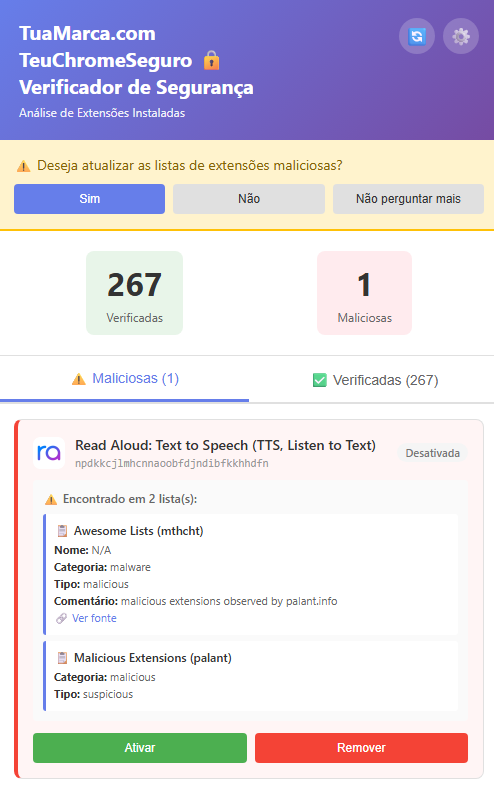
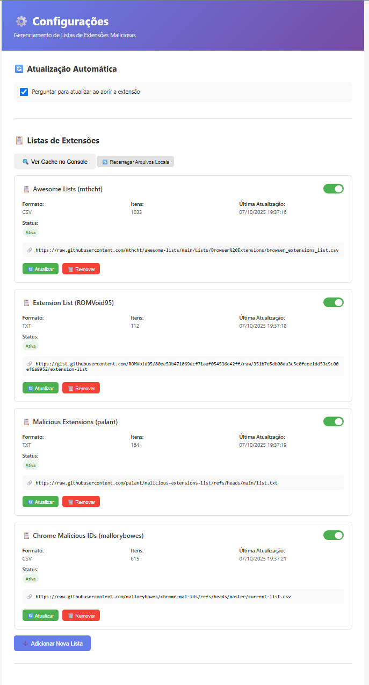
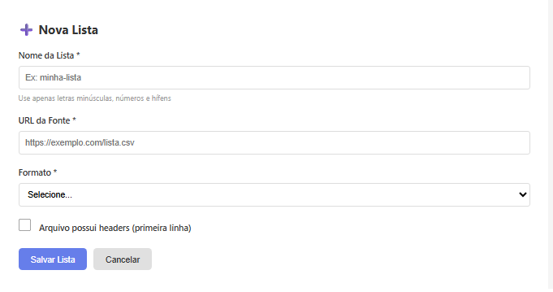

# TeuChromeSeguro — Verificador de Extensões

Ferramenta para analisar extensões instaladas no navegador e cruzá-las com listas públicas de reputação (CSV/TXT). Permite cadastrar múltiplas fontes, atualizar periodicamente e visualizar quais extensões foram sinalizadas por cada lista.

## Capturas de tela

- 
- 
- 

## Principais recursos
- Cadastro de listas remotas (CSV e TXT) via URL “raw”
- Atualização manual e opção para perguntar/atualizar ao abrir
- Deduplicação e contagem “encontrado em X listas”
- Visualização clara de extensões verificadas e sinalizadas
- Ações rápidas sobre extensões (ex.: ativar/remover, conforme suporte do navegador)

## Como funciona
1. Você registra uma ou mais fontes (URLs) de listas de extensões suspeitas/maliciosas.
2. A aplicação baixa e normaliza os dados (CSV/TXT), deduplica e armazena em cache.
3. As extensões instaladas no navegador são comparadas contra as listas.
4. O resultado exibe quais extensões foram sinalizadas e por quais listas, com links para a fonte.

## Adicionando novas listas
1. Vá em “Adicionar Nova Lista”.
2. Preencha:
   - Nome (ex.: `malicious-palant`)
   - URL da Fonte (use o link “raw” do arquivo)
   - Formato (CSV ou TXT)
   - Marque “Arquivo possui headers” se o CSV tiver cabeçalho
3. Salve e clique em “Atualizar” para carregar os itens.

## Formatos suportados

### CSV (com headers)
Mínimo: coluna `id`. Opcionais: `name`, `category`, `type`, `comment`, `source`.
```csv
id,name,category,type,comment,source
aaaaaaaaaaaaaaaaaaaaaaaaaaaaaaaa,Example Extension,malware,malicious,Listed by researchers,https://exemplo.com/post
bbbbbbbbbbbbbbbbbbbbbbbbbbbbbbbb,,malware,suspicious,,https://exemplo.com/fonte
```

### TXT (uma ID por linha)
Linhas iniciadas por `#` são ignoradas.
```txt
# IDs de extensões suspeitas
aaaaaaaaaaaaaaaaaaaaaaaaaaaaaaaa
bbbbbbbbbbbbbbbbbbbbbbbbbbbbbbbb
```

Observações:
- IDs devem ter 32 caracteres minúsculos.
- Em TXT, URLs contendo `/<id>` também podem ser aceitas se a aplicação extrair a ID (conforme configuração).

## Exemplos de fontes públicas (para referência)
- mthcht (CSV): https://raw.githubusercontent.com/mthcht/awesome-lists/main/Lists/Browser%20Extensions/browser_extensions_list.csv
- palant (TXT): https://raw.githubusercontent.com/palant/malicious-extensions-list/refs/heads/main/list.txt
- mallorybowes (CSV): https://raw.githubusercontent.com/mallorybowes/chrome-mal-ids/refs/heads/master/current-list.csv
- ROMVoid95 (TXT): gist “raw” do autor (formato: `https://gist.githubusercontent.com/<user>/<id>/raw/<commit>/extension-list`)

## Uso
- Abra a tela principal para ver o total de extensões verificadas e sinalizadas.
- Clique em uma extensão para ver detalhes, listas que a apontaram e a “fonte”.
- Use “Atualizar” nas listas para sincronizar manualmente quando quiser.

## Boas práticas
- Prefira URLs “raw” (GitHub/Gist) para evitar HTML.
- Atualize periodicamente e revise as fontes que você confia.
- Há possibilidade de falsos positivos; avalie permissões e histórico antes de remover algo essencial.


